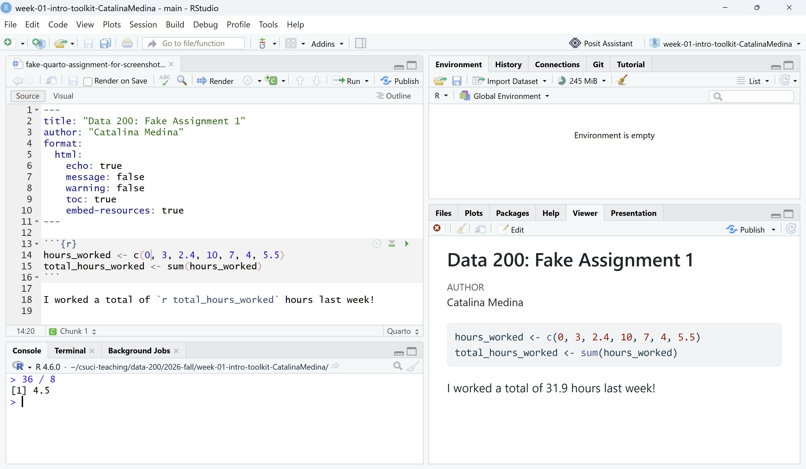
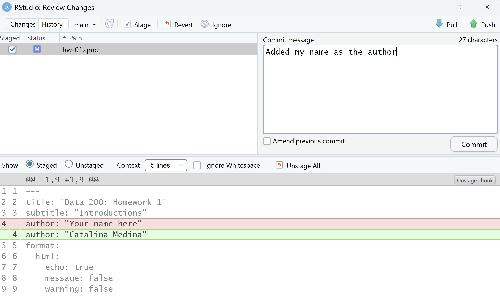
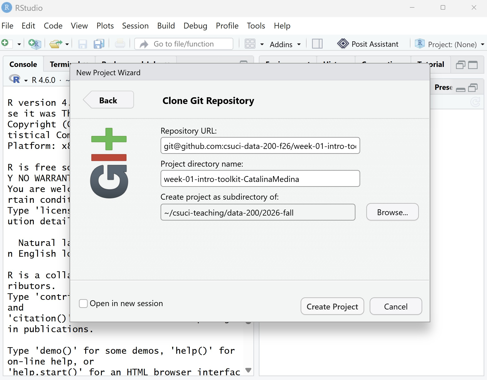
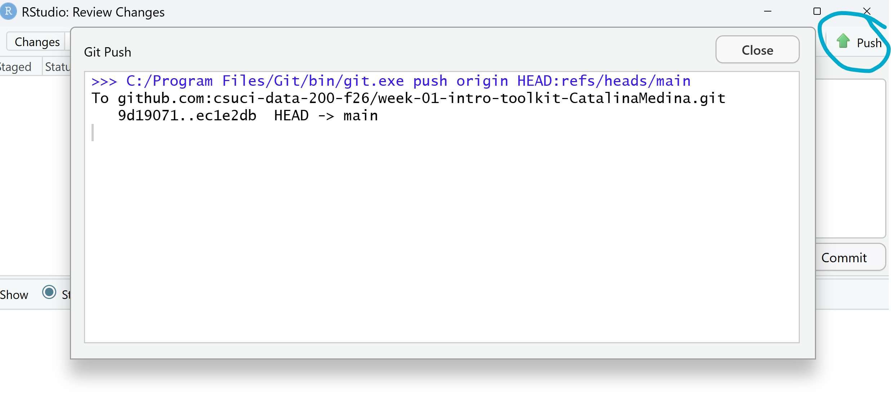
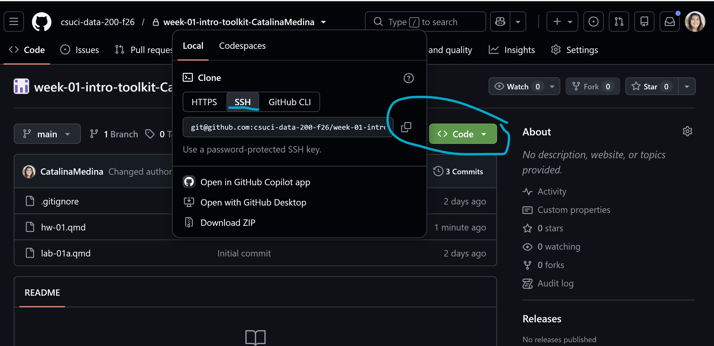

\vspace*{-2cm}

```{r}
#| echo: false
library(tidyverse)
options(scipen = 999)
```

Name:\_\_\_\_\_\_\_\_\_\_\_\_\_\_\_\_\_\_\_\_\_\_\_\_\_\_\_\_\_\_\_\_\_ Date:\_\_\_\_\_\_\_\_\_\_\_\_\_\_\_

## Understanding our toolkit

- What software will be our *engine* for DATA 200:

- What software will be our *dashboard* for DATA 200:

- What guidelines will be our *rules of the road* for DATA 200:

- What software will be our *insurance* for DATA 200:


## Coding with R

### Calculation basics

```{r}
2 + 5
```

Mark above which part is the **code** and the **output** of the code.

We can do the standard operations of `+`, `-`, `*`, `/`, `sqrt()`, `exp()`, and many more!

Describe in words what an assignment operator does:

\vspace*{2cm}

Write out `R` code to store the value $\frac{36-30}{\sqrt{7 \times 100}}$ into an object named `dolphins`.

\vspace*{2cm}

What two rules should we follow when naming variables in `R`, to comply with tidyverse style guide?


### Vectors and functions

Say I went to 5 local coffee shops and recorded the price of a cup of coffee: \$3, \$2.50, \$4.25, \$3.5, \$5. Write code to make a **vector** of these prices, and store them into an object named `coffee_prices`.

\vspace*{2cm}

The `c()` function you must have used above is an example of a **function**, functions do actions for us in R. What do you think the output of the following code using the `max()` function will be? (Hint: many function names are intuitive!)

```{r}
#| eval: false
max(coffee_prices)
```

\vspace*{1cm}

In your own words, describe what an argument of a function is.

\vspace*{2cm}

What could I do if I knew a function name, such as `sort()`, but did not remember its arguments?

\vspace*{1cm}


### Data frames

I was a little inconsistent when recording prices. The prices actually correspond to different sizes of coffees: small, small, large, medium, and large respectively. Write R code to make a vector with these sizes and store it into an object named `coffee_sizes`. 

\vspace*{1cm}


We can store the two vectors together into a **data frame** so all of the information is organized in rows and columns. Write R code that would create and print the following data frame.

\vspace*{1cm}

```{r}
#| echo: false

coffee_prices <- c(3, 2.50, 4.25, 3.5, 5)
coffee_sizes <- c("small", "small", "large", "medium", "large")

coffee_data <- data.frame(coffee_prices, coffee_sizes)

coffee_data
```


\newpage

For each code example below, identify if it follows our four tidyverse guidelines rules. If it does not, specify how which rule it violates and how it should be written.

```{r}
#| eval: false
NumberOfMeals <- c(2, 3, 3.5, 3, 3)
```

```{r}
#| eval: false
favorite_fruit<-apples
```

```{r}
#| eval: false
favorite fruit <- "apples"
```

```{r}
#| eval: false
height_in_inches<-5*12+3
```


## Quarto documents

Fill in the blanks and label their location in the RStudio screenshot below for each of the following terms: **code chunk**, **html**, , **inline `R` code**, **console**, **yaml**, **Render**.

The _________________ of a Quarto document is where we specify things for the document such as title, author, etc.

We can type regular text in the document just like a Word document, and when we want to include code it has to be in a _________________. If I want `R` code results to be printed in my rendered report then the code should be specified as _________________.

You can _________________ a Quarto document into a report in each of the following formats: html, pdf, or Word doc. In this class we will mainly produce _________________ documents.

If I want to run temporary R code that I do not want in my report, I can run the code in the _________________.


```{r}
#| label: road-img
#| echo: false
#| fig-alt: "Screenshot of RStudio showing four panes: a quarto document, the console, the viewer pane, and the environment pane. The Quarto document has a header started and ended with three tick marks. Inbetween the tickmarks are various document specifications such as title, author, format. The Quarto document shows an R chunk with basic code as well as regular text. In the viewer pane is the rendered html from the Quarto document."


```

## Version control with GitHub

Fill in the blanks using the following vocabulary: **clone**, **push**, **Git**, **GitHub**, **commit**.

We will use _________________ on our computer to help track files.

When I _________________ a **repository** from GitHub, it downloads the folder to my computer and allows me to track changes I make.

When I edit and save a file tracked with Git, I can make a _________________ to save a message explaining what I changed in the file.

I can _________________ my changes to GitHub online, so my changes aren't only saved locally on my computer.

Below are four main steps of our workflow with GitHub. Label each according to their order (e.g., "1", "2", "3", "4").

::: {layout-ncol="2"}

```{r}
#| echo: false
#| fig-alt: "Screenshot of making a commit with the message 'Added my name as the author'."


```

```{r}
#| echo: false
#| fig-alt: "Screenshot of creating a project in RStudio from the ssh copied from GitHub."



```

:::

::: {layout-ncol="2"}


```{r}
#| echo: false
#| fig-alt: "Screenshot of pusing a change from your computer to GitHub."



```

```{r}
#| echo: false
#| fig-alt: "Screenshot of GitHub repo for week 1 intro toolkit. Circled is the popout from pressing the 'Code' button and the copy button for the ssh."


```

:::


