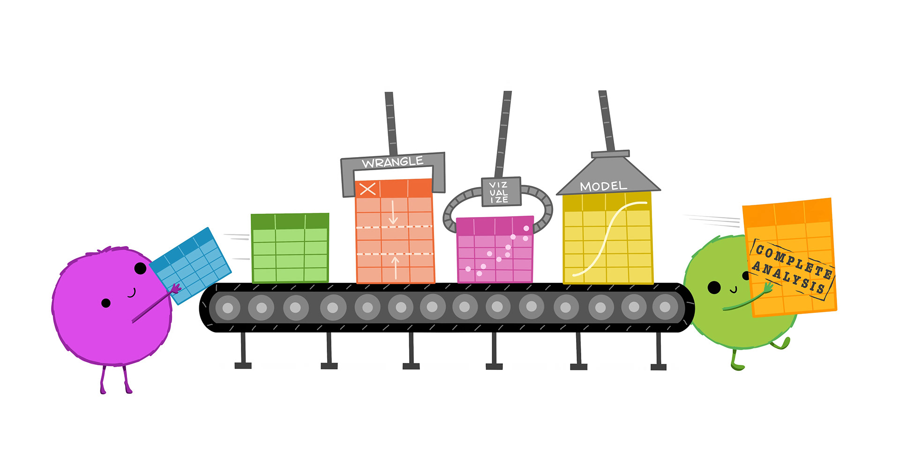

## Introductions: myself


My name is Dr. (or Professor) Catalina Medina 

::: {layout="[[1,1], [1]]"}

{fig-alt="Image of some grape vinyard with dry grass and hills."}

{fig-alt="Image of a city with some tall building surrounded by hills covered in snow."}

{fig-alt="Image of a coastline with beaches and houses."}
:::

## Introductions: you all

1. On the paper I hand out please write something about yourself (*Do not write something visually apparent like "I have long hair" and do not your name or your major*)

2. Pass your paper back to me

3. Once I pass you a random paper you have 5 minutes to find the person whose paper you have. Write their name and major on the paper

4. We will introduce each other using the paper


## What is Data Science?

Think 💭 - Pair 👫🏽 - Share 💬

What do you think data science is about and what will we learn in this course? There is no right or wrong answer.

## What is Data Science?

> Data science is an interdisciplinary academic field that uses statistics, scientific computing, scientific methods, processes, algorithms and systems to extract or extrapolate knowledge and insights from noisy, structured, and unstructured data. Wikipedia

## What is Data Science?


> Data science also integrates domain knowledge from the underlying application domain (e.g., natural sciences, information technology, and medicine). Data science is multifaceted and can be described as a science, a research paradigm, a research method, a discipline, a workflow, and a profession. Wikipedia

## 

```{r}
#| echo: false
#| fig-alt: Cute fuzzy monsters putting rectangular data tables onto a conveyor belt. Along the conveyor belt line are different automated “stations” that update the data, reading “WRANGLE”, “VISUALIZE”, and “MODEL”. A monster at the end of the conveyor belt is carrying away a table that reads “Complete analysis.”
#| fig-cap: "Illustrations from the Openscapes blog Tidy Data for reproducibility, efficiency, and collaboration by Julia Lowndes and Allison Horst"

```

## Common questions

**What types of data will we use in this course** 

We will use a variety of datasets from biological studies to business answering questions serving different purposes in life. Data will come different size, shape, and form and will include numbers, categories, text etc.

## Common question continued

**Is this a statistics course or a computing course?**

A little bit of both. 

. . .

**Do I need prior programming/statistics experience?**

Nope. No prior programming experience is expected.

## Class information

All of our class information can be found on [**CI Learn**](https://cilearn.csuci.edu/)

## Quarto illustration

```{r}
#| echo: false
#| fig-alt: A schematic representing the multi-language input (e.g. Python, R, Observable, Julia) and multi-format output (e.g. PDF, html, Word documents, and more) versatility of Quarto.
#| fig-cap: "Artwork from 'Hello, Quarto' keynote by Julia Lowndes and Mine Çetinkaya-Rundel, presented at RStudio Conference 2022. Illustrated by Allison Horst."
knitr::include_graphics("img/quarto-illustration.png")
```

## Lab

Let's kick off this class by doing some data science!

In CI Learn under this week's module there is a **lab-01a.qmd** file (this is the lab for week 1 lecture a). Please download it and open it in RStudio. 
