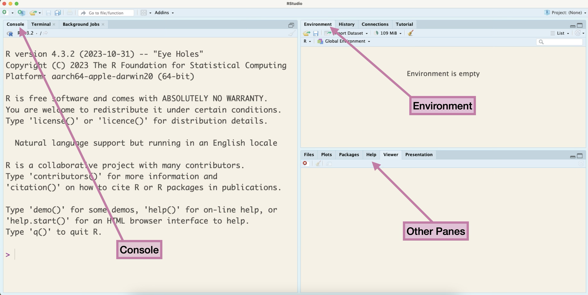
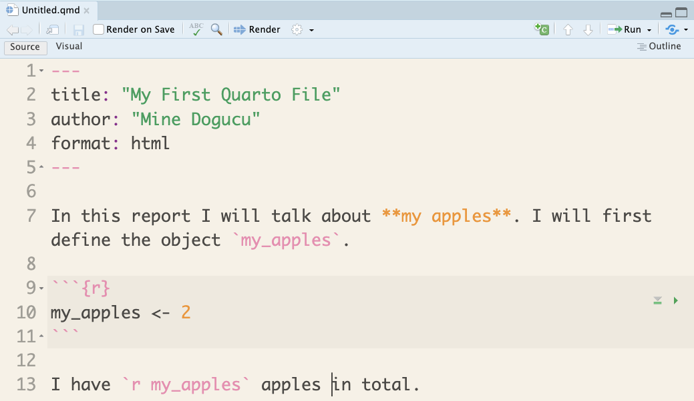
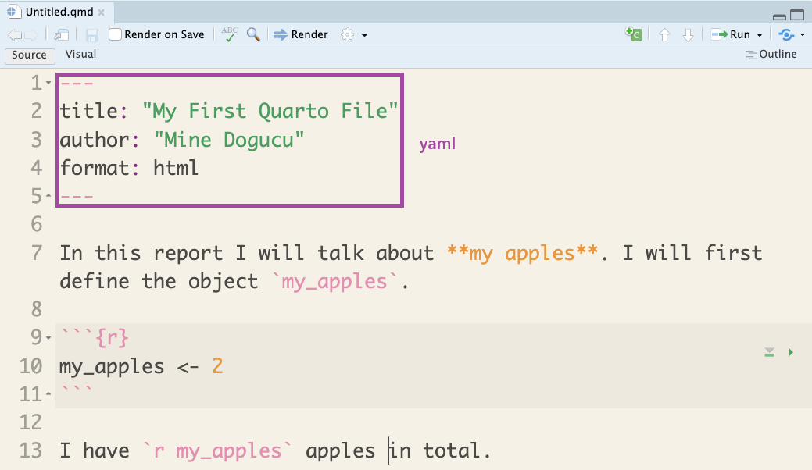
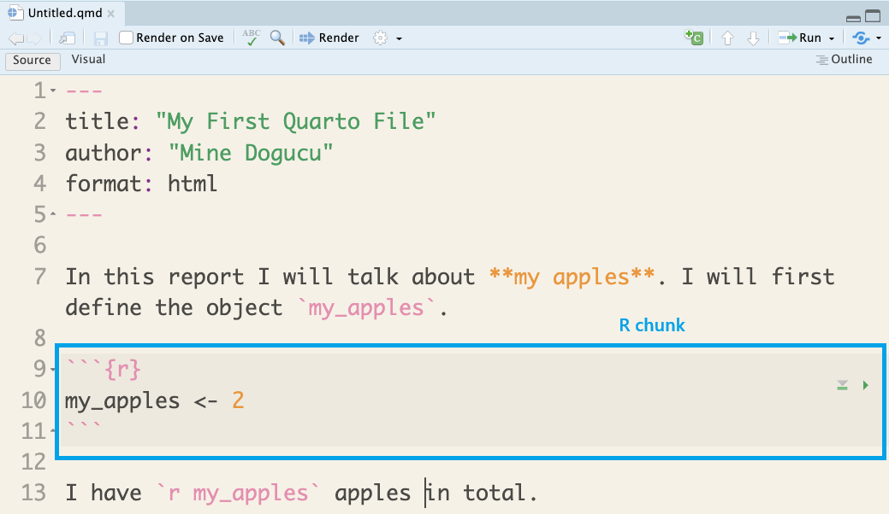
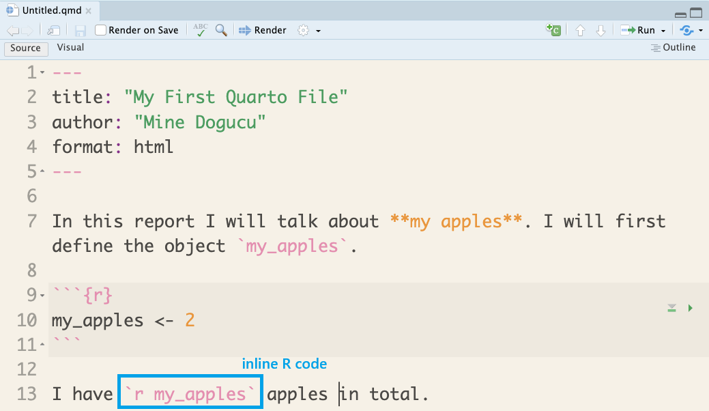
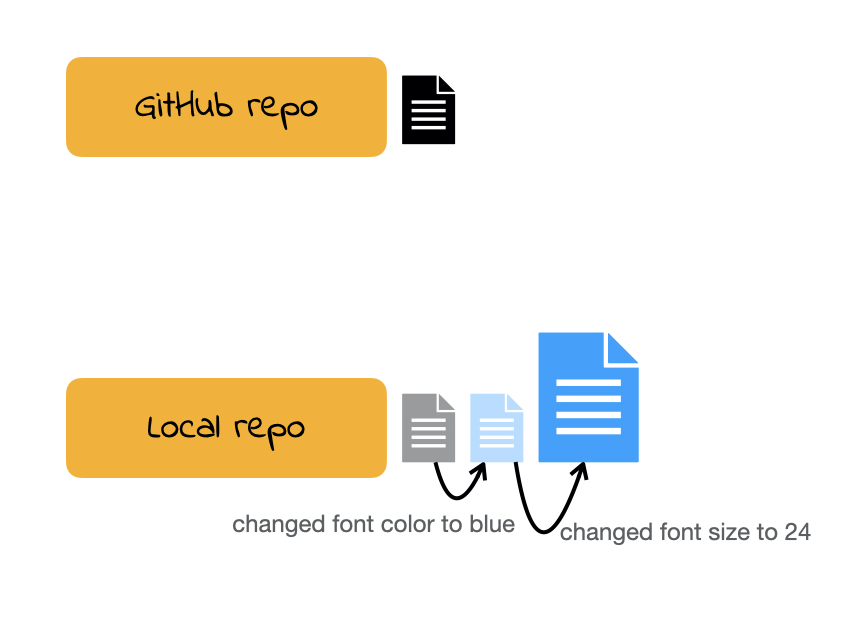

```{r}
#| echo: false
library(DiagrammeR)
library(DiagrammeRsvg)
library(rsvg)
```

# Introduction to `R`

In this class, you are learning the foundations of programming for data science.

`R` is the programming language we will use.

. . .

We will learn how to use `R` to:

- perform calculations,
- make plots, 
- import, clean, and export data, and
- fit models

## Why not let AI write your code?

AI can write code quickly, but if it writes the code for you, you miss the practice needed to learn how to:

- understand what code is doing
- diagnose and fix errors
- modify code for a new problem
- judge whether the results make sense

Struggling with code is part of learning to code.
Later, once you have these foundations, AI can be a powerful programming assistant.

## `R` as a calculator

```{r}
3 + 2
```

. . .

Notice how:

- the **code** starts with a "1" to denote line 1 of the code
- the **output** starts with "[1]" to denote line 1 of output

. . .

We can even perform more complicated calculations

```{r}
sqrt(9) * 8 / (4 * 2)
```


## Object assignment operator

`<-` is called an **assignment operator** because it says that the value on the right of the operator should be stored into the object to the left of the operator

Example: 
```{r}
my_apples <- 7
```

This means save the value `r my_apples` into the **object** `my_apples`.

. . .

We can then print the value stored in `my_apples`
```{r}
my_apples
```

## Math with objects

We can do operations with objects

```{r}
my_apples
my_apples * 2
my_apples
```

```{r}
my_new_apples <- my_apples * 2
my_new_apples
```


## R is case-sensitive

Capitalization matters!

```{r}
my_apples
```

versus 

```{r}
#| error: true
My_apples
```

## Functions

```{r eval=FALSE}
do(something)
```

`do()` is a **function**;   
`something` is the **argument** of the function, it is the function input.

. . .

```{r eval=FALSE}
do(something, colorful)
```

`do()` is a function;   
`something` is the first argument of the function;   
`colorful` is the second argument of the function.

## Example of a function

The `round()` function takes two arguments, a number and how many digits to round to.

```{r}
round(3.428, digits = 1)
```

. . .

```{r}
round(3.428, digits = 2)
```


## Vectors

A common function we will use is the `c()` function, which *combines* values into a single object, called a **vector**.

```{r}
c(13, 31)
```

. . .

```{r}
favorite_numbers <- c(13, 31)
favorite_numbers
```

. . .

```{r}
favorite_numbers <- c(13, 31, my_apples)
favorite_numbers
```


## Characters

In R, quotes tell R "this is text." 
Without quotes, R assumes you are referring to the name of an object, function, or other piece of code.

```{r}
hair_length <- "long"
hair_length
```

. . .

```{r}
#| error: true
hair_length <- long
```


. . .

```{r}
my_cats <- c("Kiki", "Thor")
my_cats
```


## Data frames

The most common object type we will work with in this class is a **data frame** which stores information in rows and columns

```{r}
n_apples <- c(7, my_apples, 3)

names <- c("Menglin", "Gloria", "Robert")

data.frame(person = names, apple_count = n_apples)
```


## Getting Help

In order to get any help we can use `?` followed by function (or object) name. 

```{r eval=FALSE}
?c
```


## tidyverse style guide

>canyoureadthissentence?

. . .

Valid R code can be formatted in many ways. 
Inconsistent formatting can make it very difficult to understand code from someone else, or even your own code!


To combat this we will follow certain code formatting guidelines, specifically the **tidyverse style guide**.

## tidyverse style guide

```{r eval = FALSE}
n_apples <- c(7, my_apples, 3)

names <- c("Menglin", "Gloria", "Robert")

data.frame(person = names, apple_count = n_apples)
```


- After function names do not leave any spaces.

- Before and after operators (e.g. <-, =) leave a space. 

- Put a space after a comma, **not** before. 

- Object names are all lower case, with words separated by an underscore.

## RStudio

RStudio is the software we will use to write code in.

```{r}
#| echo: false

```

## Quarto document

```{r}
#| echo: false

```

## Quarto parts

```{r}
#| echo: false

```

## Quarto parts

```{r}
#| echo: false

```

## Quarto parts

```{r}
#| echo: false

```

## Quarto in RStudio

```{r}
#| echo: false
knitr::include_graphics("img/quarto-example-full.png")
```


## Slides for this course

Slides that you are currently looking at are also written in Quarto. You can take a look at them on our course's [GitHub organization](https://github.com/csuci-data200-spring2026) in the lecture repo.


# Version Control

##

::: {.incremental}

Does this look familiar?

- hw1

- hw1_final

- hw1_final2

- hw1_final3

- hw1_finalwithfinalimages

- hw1_finalestfinal

:::


##

::: {.incremental}

What if we tracked our file with better names for each version and have only 1 file **hw1**?


- hw1 ***added questions 1 through 5***

- hw1 ***changed question 1 image***

- hw1 ***fixed typos***


We will call the descriptions in italic **commit** messages.

:::


## git vs. GitHub

- git allows us to keep track of different versions of a file(s).

- GitHub is a website where we can store (and share) different versions of the files. 

##

```{r}
#| out.width: '40%'
#| fig.align: 'center' 
#| echo: false
knitr::include_graphics('img/github-illustration.002.jpeg')
```

##

```{r}
#| out.width: '55%'
#| fig.align: 'center'
#| echo: false
knitr::include_graphics('img/github-illustration.003.jpeg')
```

##

```{r}
#| out.width: '55%'
#| fig.align: 'center'
#| echo: false
knitr::include_graphics('img/github-illustration.004.jpeg')
```

##

```{r}
#| out.width: '55%'
#| fig.align: 'center'
#| echo: false
knitr::include_graphics('img/github-illustration.005.jpeg')
```

##

```{r}
#| out.width: '55%'
#| fig.align: 'center'
#| echo: false

```

##

```{r}
#| out.width: '55%'
#| fig.align: 'center'
#| echo: false
knitr::include_graphics('img/github-illustration.007.jpeg')
```


## Cloning a repo

**repo** is a short form of repository. Repositories contain all of your project's files as well as each file's revision history.

For this course our weekly repos (lecture code, activity etc.) are hosted on Github. 

To **clone** a GitHub repo to our computer, we first copy the cloning link as shown in screencast then start an RStudio project using that link.  

**Cloning** a repo pulls (downloads) all the elements of a repo available at that specific time. 


## Commits

Once you make changes to your repo (e.g. take notes during lecture, answer an activity question) you can take a snapshot of your changes with a commit.

This way if you ever have to go back in version history you have your older commits to get back to. 

This is especially useful, for instance, if you want to go back to an earlier solution you have committed.


## Push

All the commits you make will initially be local (i.e. on your own computer). 

In order for us to see your commits and your final submission on any file, you have to **push** your commits. In other words upload your files at the stage in that specific time.


## (An incomplete) Git/GitHub glossary

**Git:** is software for tracking changes in any set of files

**GitHub:** is an internet host for Git projects.

**repo:** is a short form of repository. Repositories contain all of your project's files as well as each file's revision history.

## (An incomplete) Git/GitHub glossary

**clone:** Cloning a repo downloads all the elements of a repo available at that specific time. 

**commit:** A snapshot of your repo at a specific point in time. We distinguish each commit with a **commit message**. 

**push:** Uploads the latest "committed" state of your repo to GitHub.

## Do you git it?

# Hardware

- I recommend that you have a personal laptop for this class.
- If you do not have one that you can install software on, please consider renting a laptop from the [campus library](https://library.csuci.edu/services/check-out-equipment.htm) for the semester. 
- If you do not have a personal laptop, either owned or rented, then you can use [CI Virtual Labs](http://go.csuci.edu/vdi) on any computer. Once you log into CI Virtual Labs it will appear as if you are on a campus computer.

# Setting up toolkit

We will do our software installations and configurations in class together. If you missed class or need to do this for a second device, please refer to [these instructions](https://csuci-data-200-f26.github.io/lecture-materials/week-00/software-setup).

