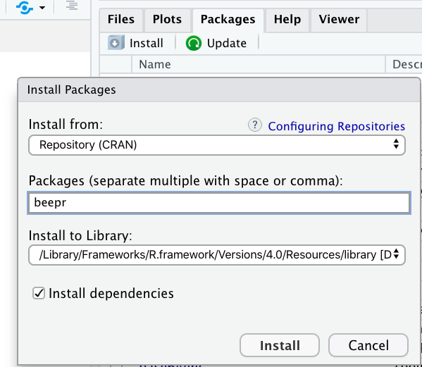
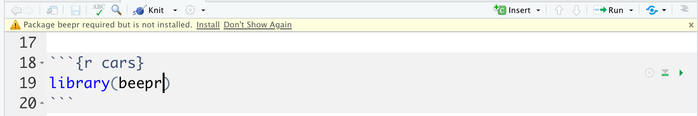
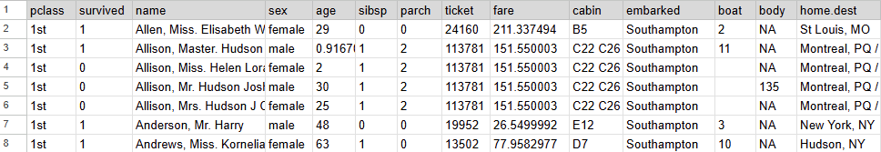
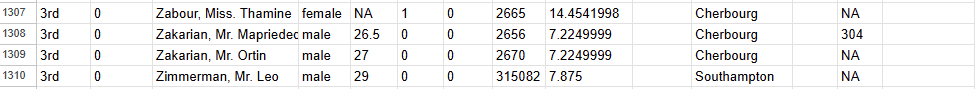
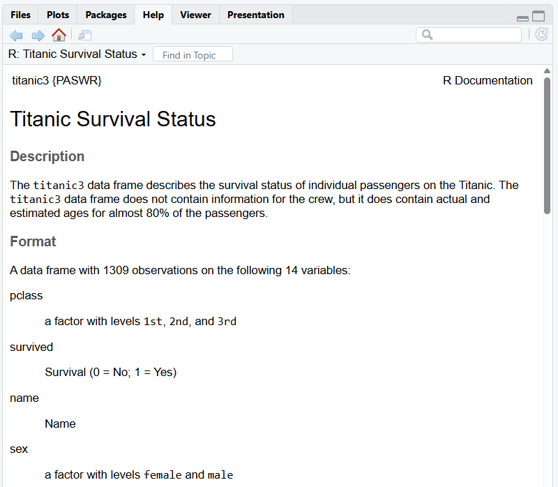
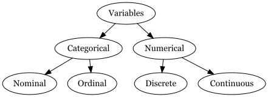

```{r}
#| echo: false
#| message: false
#| warning: false
library(fivethirtyeight)
library(openintro)
library(tidyverse)
library(DiagrammeR)
library(DiagrammeRsvg)
library(janitor)
library(bayesrules)

```

# R packages

## Phone apps vs. R packages

:::: {.columns}

::: {.column width="50%"}
When you buy a new phone it comes with some apps pre-installed.

- Calendar
- Email
- Messages
:::

::: {.column width="50%"}
If you want to use a different app you can install it.

- Instagram
- GMail
- BlueSky
:::

::::

When you download R for the first time to your computer. It comes with some packages already installed. You can also install many other R packages.

## R packages

What do R packages have? All sorts of things but mainly

- functions

- datasets

## R packages

Try running the following code:

```{r error = TRUE}
beep()
```

Why are we seeing this error?

## To install and load an R package

1. Install the package onto our computer **once**

    - Option 1: use `install.packages()` in the Console
    - Option 2: use "Install" button in "Packages" pane in RStudio

2. Load the package into **each** session/document

    - Option 1: Use the `library()` function to load entire package
    - Option 2: Use the `::` option to load a single function


## Installation option 1: `install.packages()`

In your **Console**, install the beepr package

```{r eval = FALSE}
install.packages("beepr")
```

We do this in the Console because we only need to do it once. Don't forget quotations!


## Installation option 2: Packages pane

```{r echo = FALSE, out.width="40%", fig.align='center'}

```

Packages Pane > Install


## Sometimes RStudio will prompt you to install

```{r echo = FALSE, out.width="80%", fig.align='center'}

```

If you try to skip to step 2, loading a package, without first installing it RStudio may let you know.


## Loading option 1: `library()`


Option 1 (more common)
```{r warning = FALSE, eval = FALSE}
library(beepr)
beep()
```

- Line 1 loads the library so on any following line you can use a function or dataset from the package
- Line 2 uses the package

## Loading option 2: `::`

Option 2 (less common)

```{r eval = FALSE}
beepr::beep()
```

- structure is package name, ::, function()
- This may be useful if

    - the package is large but you only want to use a function once
    - there are conflicts, i.e., multiple packages containing functions with the same name

## Open Source

- Any one around the world can create R packages.


- Good part: We are able to do pretty much anything R because someone from around the world has developed the package and shared it.


- Bad part: The language can be inconsistent.


- Good news: We have tidyverse.


## Tidyverse


>The tidyverse is an opinionated collection of R packages designed for data science. All packages share an underlying design philosophy, grammar, and data structures.

[tidyverse.org](https://tidyverse.org/)


## Tidyverse

In short, tidyverse is a family of packages we will commonly use. 

```{r}
#| eval: false
#| echo: true
library(tidyverse)
```

- Loading tidyverse loads a bunch of packages at once (e.g., ggplot2, dplyr, readr, stringr, lubridate, ...)
- It is good practice to load all packages in an RChunk at the top of your Quarto document (after yaml)

# Data basics

## Familiarizing yourself with the data

```{r}
library(PASWR)
data("titanic3")
```

The data() function loads in our `titanic3` data from the PASWR package.

## Data Frame

```{r echo=FALSE, out.width='100%'}


```

- `pclass` a factor with levels 1st, 2nd, and 3rd
- `survived` Survival (0 = No; 1 = Yes)
- `age` age in years
- `sibsp` Number of Siblings/Spouses Aboard
- ...

## Data documentation

```{r}
#| eval: false
?titanic3
```

```{r}
#| echo: false
#| fig-align: center

```


## Data Frame

The columns of a data frame are called **variables** 

The rows of a data frame are called **cases** or **observations**

For the titanic 

- the variables are: `pclass`, `survived`, `name`, `sex`, `age`, `sibsp`, `parch`, `ticket`, `fare`, `cabin`, `embarked`, `boat`, `body`, `home.dest`
- the cases/observations are passengers

## 

```{r}
ncol(titanic3)

nrow(titanic3)
```

- The data frame has `r ncol(titanic3)` __variables__ 

- The data frame has `r nrow(titanic3)` __cases__ or __observations__.

## View top of data frame

```{r}
head(titanic3)
```

## View bottom of data frame

```{r}
tail(titanic3)
```

## View structure of data frame

```{r}
glimpse(titanic3)
```

## Variable types in statistics

```{r echo = FALSE, fig.align='center'}
#| echo: false
#| fig-align: center
#| out-width: 80%
diagram <- grViz("
    digraph {
        # graph aesthetics
        graph [ranksep = 0.3]

        # node definitions with substituted label text
        1 [label = 'Variables']
        2 [label = 'Categorical']
        3 [label = 'Numerical']
        4 [label = 'Nominal']
        5 [label = 'Ordinal']
        6 [label = 'Discrete']
        7 [label = 'Continuous']

        
        # edge definitions with the node IDs
        1 -> 2
        1 -> 3
        2 -> 4
        2 -> 5
        3 -> 6
        3 -> 7
    }
")

tmp <- capture.output(rsvg::rsvg_png(
  charToRaw(export_svg(diagram)),
  'img/diagram.png')
)

 

```

Identifying the type of variable will help us to know which plots, summary statistics, and models are appropriate!

## Numerical variables

**Numerical variables** have numeric meaning, so math operations like taking a mean make sense. Numerical variables are either:

- **Discrete numerical** have a finite or countable number of possibilities (e.g., Number of siblings: 0, 1, 2, ...)
- **Continuous numerical** have an infinite number of possibilities (e.g., Distance: 1, 1.3, 1.25 miles,...)

Note not all numbers are numerical variables (i.e., zip codes are numbers but we can't add, divide, etc and get something meaningful.)

## Categorical variables

**Categorical variables** do not have numeric meaning, we can't do mathematical operations 

- **Ordinal categorical** have categories with a natural ordering (e.g., Passenger class: 1st, 2nd, or 3rd)
- **Nominal categorical** have categories without a natural ordering (e.g., Port embarked: Cherbourg, Queenstown, or Southampton)


## Storage types of variables in R

Categorical types:

- `logical`: TRUE (1), FALSE (0)  
- `character`: takes string values (e.g. a person's name, address)  
- `factor`: categorical variables with different levels
. . .

Numerical types:

- `integer`: integer (for discrete)  
- `double`: floating decimal (for continuous)
- `numeric`: integer or double  

## Check `R` storage types

```{r}
glimpse(titanic3)
```

## 

As a data scientist it is your job to check the type(s) of data that you are working with. Do not  assume you will work with clean data frames, with clean names, labels, and types.

# Describing data with numbers

## Summarizing categorical variables

- Counts

```{r}
count(titanic3, survived)
```

- Proportions

```{r}
janitor::tabyl(titanic3, pclass)
```

## Summarizing numerical variables

Some common measures of centrality:

- Mean `mean()` 
- Median `median()`

Some common measures of spread:

- Standard Deviation `sd()` 
- Variance `var()`
- Quantiles `quantile()`

The `summarize()` function can help us compute multiple summary stats together!

## Small data example


Consider the following data which represents the number of hours slept for 10 people who were surveyed.


<table>

<tr>

<td> 7 </td>
<td> 7.5 </td>
<td> 8 </td>
<td> 5.5 </td>
<td> 10 </td>
<td> 7.2 </td>
<td> 7 </td>
<td> 8 </td>
<td> 9 </td>
<td> 8 </td>


</tr>


</table>


## Mean

$$\bar x = \frac{7+7.5+8+5.5+10+7.2+7+8+9+8}{10} = 7.72$$

The mean is calculated by summing the observed values and then dividing by the number of observations.


$$\bar x = \frac{x_1 + x_2+.... x_n}{n}$$


where $\bar x$ represents the mean of observed values, $x_1$, $x_2$, ... $x_n$ represent the n observed values.


## Median

If all the observations are listed from smallest to largest (or vice versa), the median is the observation that falls in the middle. 


<table>

<tr>

<td> 5.5 </td>
<td> 7 </td>
<td> 7 </td>
<td> 7.2 </td>
<td> 7.5 </td>
<td> 8 </td>
<td> 8 </td>
<td> 8 </td>
<td> 9 </td>
<td> 10 </td>


</tr>


</table>


In this case, we have two numbers in the middle 7.5 and 8. The average of these numbers would be the median. In this case, the median is 7.75. 

$$\frac{7.5 + 8}{2} = 7.75$$

##

Median is also the 50th percentile indicating that 50% of the data fall below this value.


## Q1, Q3, and Interquartile Range

First quartile (Q1) is the point at which 25% of the data fall below of. 

Third quartile (Q3) is the point at which 75% of the data fall below of. 

Q1 and Q3 can be considered 25th and 75th percentiles respectively. 

Interquartile Range (IQR) = Q3 - Q1 which represents the middle 50% of the data.


## Small data example 2

Consider Dr. Medina teaching three classes. 
Pretend all of these classes have 5 students. 
Below are exam results from these classes. 

Class 1: 80 80 80 80 80  
Class 2: 76 78 80 82 84  
Class 3: 60 70 80 90 100  

All of these classes have a mean of 80 points. 
Do you think the mean describes these classes well? 
Can you think of any other way to describe (in words not in numbers) how these classes differ?


## Standard deviation and Variance {.smaller}


<table align = "center">
<thead>

<th>x<sub>i</sub> </th> <th> $x_i - \bar{x}$ </th> <th> $(x_i - \bar{x})^2$</sup></th>
</thead>

<tr> 
<td>5.5 </td> <td> 5.5-7.72 = -2.22 hr</td> <td> (-2.2 hr)<sup>2</sup> = 4.9284 hr <sup>2</sup> </td>
</tr>

<tr> 
<td>7 </td> <td> 7-7.72 = -0.72 hr</td> <td> (-0.72 hr)<sup>2</sup> = 0.5184 hr <sup>2</sup></td>
</tr>

<tr> 
<td>7 </td> <td> 7-7.72 = -0.72 hr</td> <td> (-0.72 hr)<sup>2</sup> = 0.5184 hr <sup>2</sup></td>
</tr>

<tr> 
<td>7.2 </td> <td> 7.2-7.72 = -0.52 hr</td> <td> (-0.52 hr)<sup>2</sup> = 0.2704 hr <sup>2</sup></td>
</tr>

<tr> 
<td>7.5 </td> <td> 7.5-7.72 = -0.22 hr</td> <td> (-0.22 hr)<sup>2</sup> = 0.0484 hr <sup>2</sup></td>
</tr>

<tr> 
<td>8 </td> <td> 8-7.72 = 0.28 hr</td> <td> (0.28 hr)<sup>2</sup> = 0.0784 hr <sup>2</sup></td>
</tr>

<tr> 
<td>8 </td>  <td> 8-7.72 = 0.28 hr</td> <td> (0.28 hr)<sup>2</sup> = 0.0784 hr <sup>2</sup></td>
</tr>

<tr> 
<td>8 </td> <td> 8-7.72 = 0.28 hr</td> <td> (0.28 hr)<sup>2</sup> = 0.0784 hr <sup>2</sup></td>
</tr>

<tr> 
<td>9 </td> <td> 9-7.72 = 1.28 hr</td> <td> (1.28 hr)<sup>2</sup> = 1.6384 hr <sup>2</sup></td>
</tr>

<tr> 
<td>10 </td> <td> 10-7.72 = 2.28 hr</td> <td> (2.28 hr)<sup>2</sup> = 5.1984 hr <sup>2</sup></td>
</tr>

</table>


## Total squared distance from the mean


$\Sigma_{i = 1}^{n} (x_i - \bar x )^2 =$

$4.9284 + 0.5184 + 0.5184 + 0.2704 + 0.0484 +$ 
$0.0784 + 0.0784 + 0.0784+ 1.6384 + 5.1984 = 13.356 \text{ hr}^2$

Note that $n$ represents the number of observations which means $n = 10$.


## Sample variance

<br>    


$$s^2 = \frac{\Sigma_{i = 1}^{n} (x_i - \bar x )^2}{n-1}$$ 


<br>

$$s^2= \frac{13.356}{10-1} = 1.484\text{ hr}^2$$


## Sample standard deviation

<br>

$$s = \sqrt{\text{sample variance}} = \sqrt{\frac{\Sigma_{i = 1}^{n} (x_i - \bar x )^2}{n-1}}$$


<br>
$$s= \sqrt{1.484} = 1.218195 \text{ hr}$$

## Mean


```{r}
summarize(titanic3, mean(age, na.rm = TRUE))
```

```{r}
mean(titanic3$age, na.rm = TRUE)
```


## Median


```{r}
summarize(titanic3, median(age, na.rm = TRUE))
```


```{r}
median(titanic3$age, na.rm = TRUE)
```


## Minimum

```{r}
summarize(titanic3, min(age, na.rm = TRUE))
```


```{r}
min(titanic3$age, na.rm = TRUE)
```

In a similar fashion maximum can be found by using the `max()` function.

## Standard deviation


```{r}
summarize(titanic3, sd(age, na.rm = TRUE))
```


```{r}
sd(titanic3$age, na.rm = TRUE)
```


## Variance


```{r}
summarize(titanic3, var(age, na.rm = TRUE))
```


```{r}
var(titanic3$age, na.rm = TRUE)
```


## Quantiles / Percentiles / Quartiles

<style type="text/css">
.tg  {border-collapse:collapse;border-spacing:0;}
.tg td{border-color:black;border-style:solid;border-width:1px;font-family:Arial, sans-serif;font-size:14px;
  overflow:hidden;padding:10px 5px;word-break:normal;}
.tg th{border-color:black;border-style:solid;border-width:1px;font-family:Arial, sans-serif;font-size:14px;
  font-weight:normal;overflow:hidden;padding:10px 5px;word-break:normal;}
.tg .tg-7rfc{border-color:inherit;font-family:Arial, Helvetica, sans-serif !important;;font-size:28px;text-align:left;
  vertical-align:top}
</style>
<table class="tg">
<thead>
  <tr>
    <th class="tg-7rfc">Quantile</th>
    <th class="tg-7rfc">Percentile</th>
    <th class="tg-7rfc">Special Name</th>
  </tr>
</thead>
<tbody>
  <tr>
    <td class="tg-7rfc">0.25</td>
    <td class="tg-7rfc">25th</td>
    <td class="tg-7rfc">First quartile</td>
  </tr>
  <tr>
    <td class="tg-7rfc">0.5</td>
    <td class="tg-7rfc">50th</td>
    <td class="tg-7rfc">Median</td>
  </tr>
  <tr>
    <td class="tg-7rfc">0.75</td>
    <td class="tg-7rfc">75th</td>
    <td class="tg-7rfc">Third quartile</td>
  </tr>
</tbody>
</table>

## Quantiles

```{r}
summarize(
  titanic3, 
  quantile(age, 0.25, na.rm = TRUE),
  quantile(age, 0.50, na.rm = TRUE),
  quantile(age, 0.75, na.rm = TRUE)
)
```

```{r echo = FALSE}
quart1 <- summarize(titanic3, quantile(age, c(0.25), na.rm = TRUE)) %>% 
  pull()

quart2 <- summarize(titanic3, quantile(age, c(0.5), na.rm = TRUE)) %>% 
  pull()

quart3 <- summarize(titanic3, quantile(age, c(0.75), na.rm = TRUE)) %>% 
  pull()
```


We would expect 25% of the data to be less than `r quart1`. 
We would expect 50% of the data to be less than `r quart2`.
We would expect 75% of the data to be less than `r quart3`.


## Advantages of `summarize()`

We can get multiple summaries with one `summarize()` function.


```{r}
summarize(
  titanic3,
  mean(age, na.rm = TRUE),
  median(age, na.rm = TRUE)
)
```

Note how the variables names in this table is not easy to read. 

## Renaming variables with `summarize()`

In order to display the variable names more legibly in the output, we can assign variable names to numerical summaries (e.g. `mean_age`).

```{r}
summarize(
  titanic3,
  mean_age = mean(age, na.rm = TRUE),
  med_age = median(age, na.rm = TRUE)
)
```