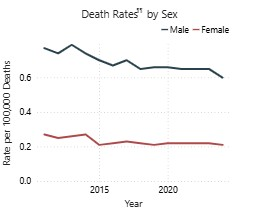

```{r}
library(tidyverse)
library(here)
```


# Hepatitis 

*These questions are included in your lab-04b.qmd file*

In this lab we will investigate viral hepatitis data for the United States. 

> "Tens of thousands of people are newly infected with viral hepatitis every year in the US. It is a serious public health threat that kills thousands of Americans annually and is a leading cause of liver cancer." (Centers for Disease Control and Prevention [CDC], 2025, “About viral hepatitis” section, para. 4).

## Question 1

Let's start by learning about viral hepatitis and why it is important to track.
Please visit this [CDC website about Hepatisits](https://www.cdc.gov/hepatitis/about/index.html).

### Question 1a

What are the three types of hepatitis and how does each spread?

### Question 1b

The CDC notes that people can have viral hepatitis without having symptoms and may spread the virus before they know they are infected. Why is it important for public health officials to track viral hepatitis cases, even though some people who are infected may not have symptoms?

### Question 1c

Why might public health officials want to track hepatitis A, hepatitis B, and hepatitis C separately rather than combining them into one total number of hepatitis cases?

# Recreating CDC Viral Hepatitis Surveillance Data Dashboard plots

We are going to reproduce plots from the [HepTracker: Viral Hepatitis Surveillance Data Dashboard](https://www.cdc.gov/hepatitis/php/data-research/heptracker/index.html).

I will assign you plot to reproduce. 
This means you will also have to filter the data accordingly (edit the example code I included below).
If you can produce a plot with the same content, nice labels, informative alternative text, and color blind friendly colors, you can get full credit.

Rules:

- You can talk to each other, but your work in `lab-04.qmd` needs to be your own and you need to be able to explain your code. If I suspect you just copied code from someone or somewhere (like generative AI) and you can't explain your code, you will not get credit. Please only use class materials as a reference.
- You have the opportunity to earn extra credit by reproducing an additional plot form the dashboard. I only assigned the line plots, so you will have to pick one of the other plots.

## Example



If I were reproduce this plot for Hepatitis B Mortality Rates by sex I would first need to look at the columns of my data and edit this filter accordingly for `event`, `type`, and `character`. 

```{r}
#| echo: true
#| eval: false

hep_data <- read_csv("https://csuci-data-200-f26.github.io/lecture-materials/data/hep-tracker-data-cleaned.csv")

hep_data_filtered <- 
  filter(
    hep_data,
    event == "Hepatitis A",
    type == "Case",
    character == "AgeGroups",
  )
```

Note, you will have to look at the help documentation for how to use `geom_line()`.
