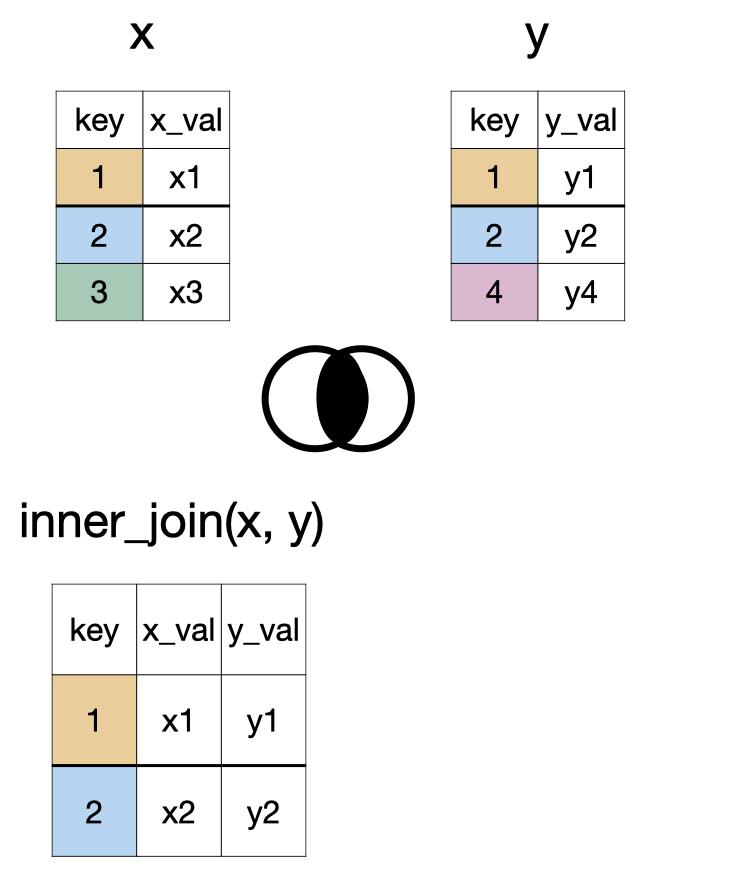

## Packages

```{r}
library(stringr) # <1>
library(lubridate) # <2>
library(forcats) # <3>
```

1. We will use the stringr package for handling strings.
2. We will use the lubridate package for handling dates.
3. We will use the forcats package for handling factors. You can think of forcats as for cat egorical variable s or as an anagram of factors.

## Packages

All these packages are part of tidyverse

```{r}
#| message: true

library(tidyverse)
```

```{r}
#| echo: false

theme_set(theme_grey(base_size = 18))

```


## Packages

We will also use 

```{r}
library(sfemergency25)
```


. . .

So far we have been downloading packages from CRAN (Comprehensive R Archive Network). 
Packages on CRAN have to meet certain criteria, including size. 
Hence package authors who don't meet this criteria host their packages elsewhere (e.g., GitHub). 

- [GitHub repo for a package on CRAN - bayesrules](https://github.com/bayes-rules/bayesrules)  
- [GitHub repo for a package not on CRAN - sfemergency25](https://github.com/hellodata-science/sfemergency25)

## Data

```{r}
data(sf911)
```


. . .

```{r}
glimpse(sf911)
```

## Class expectations

You **are not** expected to memorize every function for manipulating strings, factors, and dates!

You **are** expected to:

- identify variable types and describe what you want to accomplish
- use available resources to find appropriate code
- check that the result is what you intended

::: {.callout-note}
The goal is not to memorize a list of functions. The goal is to learn how to solve data-manipulation problems.
:::

# Strings

## Replace a string

::::{.columns}

:::{.column}
```{r}
sf911 |> 
  select(address) |> 
  head(3)
```

:::

:::{.column}


:::
::::

## Replace a string

::::{.columns}

:::{.column}
```{r}
sf911 |> 
  select(address) |> 
  head(3)
```

:::

:::{.column}

```{r}
sf911 |> 
  mutate(
    address_long = str_replace(
      address, 
      pattern = "ST", 
      replacement = "STREET"
    )
  ) |>
  select(address_long) |> 
  head(3)
```

:::
::::


## Replacing multiple strings

```{r}
address_key <- 
  c(
    "ST"   = "STREET", 
    "AVE"  = "AVENUE", 
    "PL"   = "PLACE", 
    "TER"  = "TERRACE"
  )
```


## Replacing multiple strings

::::{.columns}

:::{.column}
```{r}
sf911 |> 
  select(address)
```

:::

:::{.column}

```{r}
sf911 |> 
  mutate(
    address_long = str_replace_all(
      address, 
      pattern = address_key
    )
  ) |>
  select(address_long)
```

:::
::::


## Replacing multiple strings with specific matches

```{r}
address_key <- c(
  "\\bST\\b"  = "STREET",
  "\\bAVE\\b" = "AVENUE",
  "\\bPL\\b"  = "PLACE",
  "\\bTER\\b" = "TERRACE"
)

sf911 |> 
  mutate(address_long = str_replace_all(address, pattern = address_key)) |> 
  select(address_long)
```


## Changing capitalization

```{r}
sf911 |> 
  select(address) |> 
  mutate(address = str_to_title(address)) |>
  head()
```

We can also use `str_to_upper()` or `str_to_lower()` as needed

## Gluing strings together

```{r}
sf911 |> 
  mutate(
    description = str_glue(
      "Incident {call_number} occurred in {neighborhoods_boundaries}"
    )
  ) |> 
  select(description) |> 
  head(3)
```

## Detecting a pattern

```{r}
sf911 |>
  mutate(is_fire_related = str_detect(call_type, pattern = "Fire|Smoke")) |>
  select(call_type, is_fire_related) |> 
  head(10)
```

# Dates


## ISO Date

While there are many ways to write a date for humans, there is only one universally accepted format for data as standardized by the International Organization for Standardization (ISO). It follows the order of YYYY-MM-DD (e.g., 1986-12-20). 

Writing dates this way ensures they are sorted correctly by computers and avoids any international confusion between months and days.


## UTC and time zones

- **Coordinated Universal Time (UTC)** is the international reference for time.
- UTC does not change for daylight saving time, making it useful for storing times and calculating differences.
- Camarillo uses Pacific Time:
  - **PST:** UTC−8, from early November to mid-March
  - **PDT:** UTC−7, from mid-March to early November
  
Understanding time zones helps to avoid incorrect times and calculations when data come from different locations or cross daylight saving time transitions.

## Storing dates and times

::::{.columns}

:::{.column}

```{r}
sf911 |> 
  select(received_dt_tm) |> 
  head(3)
```

:::

:::{.column}


:::

::::

## Storing dates and times

::::{.columns}

:::{.column}

```{r}
sf911 |> 
  select(received_dt_tm) |> 
  head(3)
```

:::

:::{.column}

```{r}
sf911 |>
  mutate(
    received_dt_tm = ymd_hms(
      received_dt_tm
    )
  ) |> 
  select(received_dt_tm)
```

:::

::::

## Storing dates and times

### First check if your code works as expected

```{r}
sf911 |>
  mutate(received_dt_tm = ymd_hms(received_dt_tm)) |> 
  select(received_dt_tm) |> 
  head(3)
```

### The update your dataset

```{r}
sf911 <- 
  sf911 |>
  mutate(received_dt_tm = ymd_hms(received_dt_tm))
```


## Storing dates and times with time zones

```{r}
sf911 <-
  sf911 |> 
  mutate(
    received_dt_tm = with_tz(received_dt_tm, tzone = "America/Los_Angeles")
  )

sf911 |> 
  select(received_dt_tm) |> 
  head(3)
```

. . .

`OlsonNames()` function lists different names of timezones.

## hour, month and week day

```{r}
sf911 |> 
  mutate(
    hour_val = hour(received_dt_tm),
    month_val = month(received_dt_tm, label = TRUE),
    day_name = wday(received_dt_tm, label = TRUE)
  ) |> 
  select(received_dt_tm, hour_val, month_val, day_name) |> 
  head(3)
```

## duration

```{r}
sf911 |>
  mutate(
    goal_arrival_time = received_dt_tm + dseconds(480)
  ) |>
  select(received_dt_tm, goal_arrival_time) |>
  head(3)
```
 
## duration

```{r}
#| label: ddays-days
event_start <- ymd_hms("2026-03-07 05:00:00", tz = "America/Los_Angeles")

event_start + ddays(1)
event_start + days(1)
```

::: callout-note

## Note

When performing math with dates, lubridate distinguishes between two ways of measuring time: durations and periods. 
This distinction is critical when your data spans a Daylight Saving Time (DST) transition.

- When you add duration of exactly 1 day using the `ddays()` function, you are simply adding 86,400 seconds. 
- On the other end, the `days()` function just adds one day to the calendar day without touching the time component. 

:::

## difftime


```{r}
#| label: response-time
sf911 <- 
  sf911 |> 
  mutate(
    on_scene_dt_tm = ymd_hms(on_scene_dt_tm), 
    response_time = on_scene_dt_tm - received_dt_tm 
  ) 

str(sf911$response_time)
```

## today and now

```{r}
today()
now()
```


# Factors

## `as.factor()`

```{r}
sf911 <-
  sf911 |>
  mutate(unit_type = as.factor(unit_type)) 
  
str(sf911$unit_type)
```

```{r}
levels(sf911$unit_type)
```

## `levels()` as seen in ggplot

```{r}
#| label: fig-unit-alpha
#| fig-alt: "A horizontal bar chart titled by unit type, showing the count of various emergency service unit types. From bottom to top, the Y-axis lists unit categories including: AIRPORT, BLS, CHIEF, CP, ENGINE, INVESTIGATION, MEDIC, PRIVATE, RESCUE CAPTAIN, RESCUE SQUAD, SUPPORT, and TRUCK. The X-axis represents counts ranging from 0 to 90,000+ (in increments of 30,000). ENGINE appears to have the highest count, exceeding 90,000, while unit types such as AIRPORT, and INVESTIGATION appear to have the lowest counts, close to zero. The chart provides a comparative view of how frequently each unit type appears in the dataset."

ggplot(sf911, aes(y = unit_type)) +
  geom_bar()
```

## `fct_infreq()`

```{r}
#| label: fct-infreq
sf911 <- 
  sf911 |> 
  mutate(unit_type = fct_infreq(unit_type)) #<1>

str(sf911$unit_type) #<2>
```

## `levels()` as seen in ggplot

```{r}
#| label: fig-unit-freq
#| fig-alt: "A horizontal bar chart showing the count of emergency service unit types, ordered from least to most frequent. The Y-axis lists unit types from lowest (on top) to highest frequency (in the bottom): AIRPORT, INVESTIGATION, RESCUE SQUAD, SUPPORT, BLS, RESCUE, CAPTAIN, CP, CHIEF, PRIVATE, TRUCK, MEDIC, and ENGINE. The X-axis represents counts from 0 to 90,000+ (in increments of 30,000). ENGINE has the highest count, exceeding 90,000, followed by MEDIC and TRUCK. AIRPORT and INVESTIGATION have the lowest counts, close to zero. This frequency-sorted view makes it easy to identify the most and least common unit types in the dataset."

ggplot(sf911, aes(y = unit_type)) +
  geom_bar()
```

## `levels()` as seen in ggplot with `fct_rev()`

```{r}
#| label: fig-unit-rev
#| fig-alt: "A horizontal bar chart showing the count of emergency service unit types, ordered from most frequent to least. The Y-axis lists unit types from lowest (in the bottom) to highest frequency (on top): AIRPORT, INVESTIGATION, RESCUE SQUAD, SUPPORT, BLS, RESCUE, CAPTAIN, CP, CHIEF, PRIVATE, TRUCK, MEDIC, and ENGINE. The X-axis represents counts from 0 to 90,000+ (in increments of 30,000). ENGINE has the highest count, exceeding 90,000, followed by MEDIC and TRUCK. AIRPORT and INVESTIGATION have the lowest counts, close to zero. This frequency-sorted view makes it easy to identify the most and least common unit types in the dataset with the most frequent bar on top."
 
sf911 |>
  mutate(unit_type = fct_rev(unit_type)) |> 
  ggplot(aes(y = unit_type)) +
  geom_bar()
```

## `levels()` as seen in ggplot with `fct_lump_n()`

```{r}
#| label: fig-unit-lump
#| fig-alt: "A horizontal bar chart titled unit_type on the y-axis and count on the x-axis. The chart displays the frequency of four categories: Other: The most frequent category, with a count of nearly 120,000. ENGINE: The second most frequent, with a count of approximately 110,000. MEDIC: Slightly lower than ENGINE, with a count of approximately 100,000. TRUCK: The least frequent, with a count of approximately 40,000. The order of the categories go as Other, TRUCK, MEDIC, and ENGINE from top to bottom."

sf911 |>
  mutate(unit_type = fct_lump_n(unit_type, n = 3)) |>
  ggplot(aes(y = unit_type)) +
  geom_bar()
```


## `fct_relevel()`

```{r}
#| label: fct-relevel
sf911 |>
  mutate(unit_type = fct_relevel(unit_type, "ENGINE")) |> # <1>
  group_by(unit_type) |>
  summarize(total_als_unit = sum(als_unit))

```


## `fct_relevel()`

```{r}
#| label: fct-relevel2
sf911 |>
  mutate(unit_type = fct_relevel(unit_type, "ENGINE", "TRUCK")) |> # <1>
  group_by(unit_type) |>
  summarize(total_als_unit = sum(als_unit))

```


## `fct_reorder()`


```{r}
#| label: fct-reorder
sf911 <- sf911 |>
  mutate(
    neighborhoods_boundaries = as.factor(neighborhoods_boundaries), # <1>
    neighborhoods = fct_reorder(neighborhoods_boundaries, response_time) # <2>
    ) 

str(sf911$neighborhoods_boundaries)
str(sf911$neighborhoods)
```

## Your responsibility: Factors, strings, and dates

You do not need to recall the exact function from these slides immediately.

You do need to be able to:

> **Describe the problem, find a possible solution, and verify the result.**

## A problem-solving process

When you need to manipulate a variable:

1. **Identify its type.** Is it a string, factor, or date?

2. **Describe the desired result.** What should change? What should stay the same?

3. **Find a possible function.** Use documentation, a cheatsheet, a search engine, or generative AI.

4. **Check the result.** Did the code produce the values and variable type you expected?

5. **Revise if needed.** Read error messages and adjust your code or search terms.

# Data Joins

Combining multiple datasets into a single dataset is a common occurrence.

- You need to be able to identify what you want for the resulting data set. Considerations:
  - What column(s) should be used to match the two datasets?
  - Do you want to keep all of the rows?
  - Do you want to keel all of the columns, 
  
```{r}
#| echo: false
artists <- readxl::read_xlsx(here::here("data/spotify.xlsx"), sheet = "artist")
songs <- readxl::read_xlsx(here::here("data/spotify.xlsx"), sheet = "top_song")
albums <- readxl::read_xlsx(here::here("data/spotify.xlsx"), sheet = "album") |> 
mutate(album_release_date = lubridate::ymd(album_release_date))
```

## `inner_join(x, y)`

```{r}
#| echo: false
#| fig-align: center
#| out-width: 45% 

```

## `full_join(x, y)`


```{r}
#| echo: false
#| fig-align: center
#| out-width: 45% 
knitr::include_graphics("img/full-join.png")
```

## `left_join(x, y)`

```{r}
#| echo: false
#| fig-align: center
knitr::include_graphics("img/left-join.png")
```


## Example join data

::: {.panel-tabset}

## artists

```{r}
artists
```

## songs

```{r}
songs
```

## albums

```{r}
albums
```


:::

## Example join strategy

```{r}
#| echo: false
#| fig-align: center
knitr::include_graphics("img/data_joins_spotify.png")
```

## `inner_join()` example

```{r}
inner_join(songs, artists)
```

## `full_join()` example

```{r}
full_join(songs, artists)
```

## `left_join()` example

```{r}
left_join(songs, artists)
```

## Multiple `full_join()`'s example

```{r}
full_join(songs, artists)
```

```{r}
full_join(songs, artists, by = "name") |> 
  full_join(albums, by = "album_name")
```
